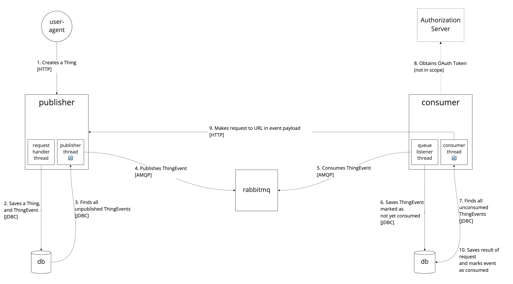

#   Thin Events / Rich APIs Reference Implementation

Reference implementation that demonstrates the "thin events / rich apis" integration pattern using Spring AMQP and
RabbitMQ.

There are two applications:
*   `publisher`
*   `consumer`

The `publisher` publishes events when its state changes (e.g.: the collection of entities it manages changes), and the
`consumer` consumes those events. We assume that the consumer's bounded context has some mapping to the publisher's
bounded context, and the events are how the publisher notifies the consumer of changes in state so that the consumer
can update itself accordingly. For simplicity there is no actual business logic implemented to demonstrate the assumed
context mapping.

The events are "thin" meaning they don't contain enough information for a consumer to update its own state accordingly.
Instead, the events contain just enough information to inform a consumer of how to get the information it needs to
update its own state. In this example, the event payload contains the URL of the entity that changed. The consumer can
use that URL to make a request to the publisher's API to get the information necessary to update itself.

The RabbitMQ [Fanout Exchange](https://www.rabbitmq.com/tutorials/amqp-concepts.html#exchange-fanout) is used so that
the publisher can be certain events will be published to whoever is listening at the moment, even if it's no one. The
publisher doesn't care if anyone is listening because its own internal state is consistent; it's only publishing events
to be a good participant in a system, allowing other applications to react to change in its state, extremely similar to
how an aggregate root publishes domain events.

This implementation also includes patterns to guarantee eventual event publication such as the persistence of events
themselves with publication metadata, the delegation of responsibility of event publication to a background thread, and
RabbitMQ publisher confirms. The consumer's implementation guarantees eventual reaction to events in a similar way such
as the persistence of received events, the delegation of responsibility of reaction to received events to a background
thread, and RabbitMQ ACKs and NACKs.



##  Build

`./gradlew clean build`

##  Run

Run a RabbitMQ instance
```shell
docker run -d --hostname rabbitmq --name demo -p 5672:5672 -p 15672:15672 rabbitmq:3-management
```

Run the publisher
```shell
./gradlew :publisher:bootRun
```

Run the consumer
```shell
./gradlew :consumer:bootRun
```

##  Interact

Make a `Thing` to publish an event:

```http request
POST http://localhost:8080/things
Content-Type: application/json

{ "content": "some-content-000" }
```

##  Observe

Distributed applications are hard to observe. Even in this trivialized example there are two applications, each with
their own HTTP APIs, messages flowing between them brokered by a third application (RabbitMQ), and requests being made
from one to another.

The `publisher` and `consumer` applications provide three ways to increase observability, and ameliorate maintenance and
operations of the system:

1.  Meaningful log messages, logged at the appropriate level. Tail the logs of each application to gain insight into
    what is happening as it happens.
1.  Spring Boot Actuator endpoints related to RabbitMQ:

    *   http://localhost:8080/actuator/metrics
    *   http://localhost:8081/actuator/metrics

    Each of these metrics can be queried to gain additional insight into application state. For example:

    *   Make a request to http://localhost:8080/actuator/metrics/rabbitmq.published to see the count of published events
    *   Make a request to http://localhost:8081/actuator/metrics/rabbitmq.acknowledged to see the count of acknowledged
        events
1.  A database web console (for development purposes only). Query the database tables to observe how the state changes
    as events are published and consumed.

    *   http://localhost:8080/h2-console
        *   JDBC URL: jdbc:h2:mem:publisher
        *   Username: sa
        *   Password:
    *   http://localhost:8081/h2-console
        *   JDBC URL: jdbc:h2:mem:consumer
        *   Username: sa
        *   Password:

##  Test

The functionality of the `publisher` and `consumer` applications is documented using automated test that apply two
distinct methodologies:

1.  Black-box application tests
1.  Contract tests

> Using this combination of using narrow integration tests and contract tests, I can be confident of integrating against an external service without ever running tests against a real instance of that service, which greatly eases my build process.
 -Martin Fowler

### Black-box Application Tests

The `publisher` application has a suite of integration tests in [PublisherApplicationTests](publisher/src/test/java/dev/samsanders/demo/rabbitmq/publisher/PublisherApplicationTests.java)

These tests use an embedded [Apache Qpid](https://qpid.apache.org/) AMQP broker. Note that this embedded AMQP broker is
not RabbitMQ. This decision accepts the tradeoff of speed and portability in favor of dev/prod-parity, relying on the
AMQP standard as a mitigation. The embedded nature of the broker also obviates the need for a dedicated AMQP broker,
network connectivity for automated tests, or additional environmental requirements (e.g.: Docker) in CI. This decision
is easily debatable, and is not based on a strongly-held opinion.

The primary focus of these tests is _how_ information is published.

For example, in the `publisher`'s `happyPath` test expects that an event is created when a `Thing` is created, and that
event is unpublished until the `ThingEventPublisher` is called upon to do its job: `publishAllUnpublishedThingEvents`.
Once that job is done, the test expects that the event has been published.

Review the integration tests to learn more.

The `consumer` doesn't have this type of test because all it does is consume information from the `publisher`, and that
can be tested using contract tests. However, a real consumer application with actual functionality would probably need
one to test that functionality.

### Contract Tests

#### Publisher

The `publisher` application's ability to create and publish events is documented by the black-box application tests, but
what about _what_ is published?

The `publisher` application addresses this concern by defining a contract that specifies what is published, and to
where. This contract is used by Spring Cloud Contract at build time to automatically generate tests that validate the
contract is accurate, as well as to generate a "stub" jar that can be used by a consumer to build an integration with
confidence, yet without necessarily having access to an instance of `publisher`.

For details review the `publisher` [messaging contract](publisher/src/test/resources/contracts/messaging/publish-thing-event.yml)
, the [generated contract tests](publisher/build/generated-test-sources/contracts/dev/samsanders/demo/rabbitmq/publisher/contracts/MessagingTest.java)
, and observe the generated [stubs jar](publisher/build/libs/publisher-0.0.1-SNAPSHOT-stubs.jar) alongside the
application jar. Note the `publisher` also has contracts, and tests for its web API so that consumers of the
messages/events can also build a reaction to those events with confidence.

#### Consumer

The `consumer` application intends to consume events published by `publisher`, so it's important that the `consumer`
knows exactly what those events look like. The `consumer` also intends to react to the events by making requests to the
`publisher`'s web API. What could be better than using a stub artifact created and verified by the `publisher` itself
that provides build-time assurance of both the messaging and web APIs?

The `consumer` downloads the stub jar generated by the `publisher` using Spring Cloud Contract's Stub Runner:
> Stub Runner lets you automatically download the stubs of the provided dependencies (or pick those from the classpath), start WireMock servers for them, and feed them with proper stub definitions. For messaging, special stub routes are defined.
> (https://cloud.spring.io/spring-cloud-contract/reference/html/project-features.html#features-stub-runner-core)

The `consumer` accomplishes this using a test with the `@AutoConfigureStubRunner` annotation which specifies where the
stubs can be found.

The test can use `StubTrigger` to publish an event that conforms to the contract defined by the publisher, effectively
allowing the `consumer` code to execute as it would in an integration environment.

For details review the [`ConsumerStubTests`](consumer/src/test/java/dev/samsanders/demo/rabbitmq/consumer/ConsumerStubTests.java).

##  References

*   [AMQP 0-9-1 Model Explained](https://www.rabbitmq.com/tutorials/amqp-concepts.html)
*   [Spring AMQP Reference Documentation](https://docs.spring.io/spring-amqp/reference/html)
*   [Spring Cloud Contract Reference Documentation](https://cloud.spring.io/spring-cloud-contract/reference/html/index.html)
*   [Spring Cloud Contract Stub Runner](https://cloud.spring.io/spring-cloud-contract/reference/html/project-features.html#features-stub-runner)
*   [Maven Publish Plugin](https://docs.gradle.org/current/userguide/publishing_maven.html#publishing_maven)
*   [Integration Tests](https://martinfowler.com/bliki/IntegrationTest.html)
*   [Apache Qpid Broker-J](https://qpid.apache.org/releases/qpid-broker-j-7.0.4/book/index.html)
